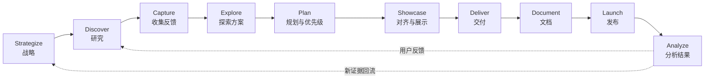
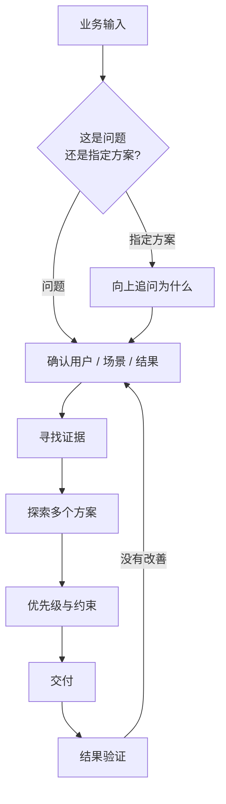
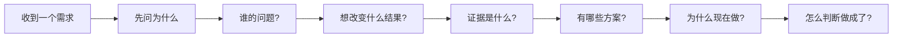

# 结合业务学产品 00｜前言：拿真实业务当课本

这门课不是为了把一套“产品经理知识体系”从头背到尾。

我们已经在真实项目里不断碰到产品问题：一句话需求到底是什么意思，用户为什么要这个功能，业务目标和页面需求之间差了几层，什么应该先做，什么其实不该做，一个看起来合理的方案到底有没有证据。

过去很多时候，这些问题是边做边补。这样能把事情推进，但也容易留下一个缺口：我们会做页面、会讨论交互、会和研发一起把功能落地，却未必总能把**需求上游的判断**说清楚。

所以这门课只做一件事：

> **把真实业务当课本，用双方都能完整读取的公开材料，补齐产品判断。**

Mira 负责带学，排第一作者；Tomz 带着真实业务进入课堂，排第二作者。

## 课程状态

| 项目 | 当前状态 |
| --- | --- |
| 课程状态 | 进行中 |
| 课程设计 | 已修订为完整可读主线 |
| 知识课进度 | 0 / 10 |
| 已完成 | 00｜前言：拿真实业务当课本 |
| 下一课 | 01｜先看全局：一个产品到底怎么从业务目标走到结果验证？ |
| 下一课主材料 | Aha!《The product development process in 10 stages》 |
| 下次开始 | 先画完整生命周期，再拿一个真实业务定位它现在卡在哪一段 |
| 最近更新 | 2026年8月24日 |

**以后重新开始这门课，先看这一节。**

每完成一课，都必须回来更新“知识课进度 / 已完成 / 下一课 / 下次开始”。这张表就是课程检查点，不另外维护一份容易失真的学习台账。

## 为什么换掉上一版主教材

上一版把 Product Talk 2026 的 Continuous Discovery Habits Book Club 当成主线。

开始第一课后我们发现：公开页面可以读，但其中核心学习路径依赖《Continuous Discovery Habits》书中章节，而书本正文并没有完整公开。

这违反了本课程最基本的规则：

> **如果 Mira 不能从头读到尾，就不能把它当成连续主教材。**

因此 Product Talk 不再承担主线课程，只保留为某些 Discovery 主题的补充阅读。

## 资料规则：能一起完整读，才算主教材

课程材料至少满足：

1. Tomz 可以正常打开；
2. Mira 可以直接读取正文，而不是只看到标题、摘要或课程目录；
3. 主教材必须从课程起点连续覆盖到课程终点；
4. 页面地址稳定，不依赖登录或付费墙；
5. 内容足够具体，可以拿真实业务检验；
6. 材料失效就换，不把“搜到过”冒充“学过”。

视频没有公开文字稿、需要登录才能继续、只开放试读章节的材料，都不能承担主线。

## 新主线：Aha! 2026 产品开发完整指南

主教材：

https://www.aha.io/roadmapping/guide/stages-of-product-development

配套完整框架：

https://www.aha.io/roadmapping/guide/the-aha-framework/the-aha-framework-for-product-development

这套材料在 2026 年仍然更新，而且核心流程全文公开。

它把产品工作拆成十个阶段：

这张图就是第一阶段课程的骨架。

它的价值不在于让我们死记十个英文单词，而是让我们以后接到一个业务需求时，先知道：

> **我们现在到底在做哪一类产品判断？前面的证据够不够？后面的结果怎么验证？**

### 对 Aha! 的使用边界

Aha! 是商业产品公司，它的指南天然会带有自己的方法论与工具视角。

所以我们采用它的**流程骨架和公开实务内容**，但不把以下内容当作结论：

- “必须使用 Aha! 软件”；
- 为了匹配工具而设计流程；
- 把品牌自创术语当作行业唯一标准。

每一课都允许质疑教材。

## 校验材料：Product Manager Handbook

辅助知识库：

https://productmanagerhandbook.com/

它在 2025 年上线，定位就是免费、持续更新的数字产品管理知识库，内容由有实际经验的产品经理作者撰写，并经过产品经理审核。

我们主要用它交叉检查这些问题：

- 产品经理到底负责什么；
- Stakeholder Input 应该怎么进入产品判断；
- Vision / Strategy / Discovery / Delivery 的边界；
- 上线之后为什么还需要 Evaluation；
- 用户价值与业务可行性如何同时成立。

它不是第二套必须从头刷完的课程，而是**校验尺**。

## 第一阶段：10 课完整路线

| 课次 | 核心问题 | 对应主线 |
| --- | --- | --- |
| 01 | 一个产品到底怎么从业务目标走到结果验证？ | 全局：10 stages |
| 02 | “老板要做这个”之前，战略到底应该回答什么？ | Strategize |
| 03 | 用户说的话，怎样变成真正可用的研究证据？ | Discover |
| 04 | 一堆反馈和一句话需求，怎么收集而不被牵着跑？ | Capture |
| 05 | 发现问题以后，为什么不能立刻画第一个方案？ | Explore |
| 06 | 需求很多，凭什么先做这个？ | Plan |
| 07 | Roadmap、原型和汇报，究竟是在对齐什么？ | Showcase |
| 08 | 从需求到研发交付，产品要守住哪些东西？ | Deliver |
| 09 | 上线不是结束：文档、发布和组织准备为什么也属于产品？ | Document + Launch |
| 10 | 做完以后怎么知道它不是白做？ | Analyze |

这十课构成完整第一阶段。

不需要等作者以后继续更新，我们现在就已经能从第一课一直学到第十课。

## 图解优先：课程不是文字墙

从这一版开始，课程增加一条明确的表达规则：

> **凡是关系、流程、分支、层级、状态能用图说清楚，就优先画图。**

### Mermaid 优先

适合：

- 业务流程；
- 用户路径；
- 状态机；
- 因果关系；
- 决策树；
- 产品生命周期；
- 需求从输入到验证的链路。

例如，今后我们不会只写：

“业务提出需求，产品分析用户问题，再形成方案，然后交付。”

而会直接画成：

### HTML 用在 Mermaid 不擅长的地方

如果需要表达：

- 对比卡片；
- 可视化矩阵；
- 密集的信息分区；
- 简单交互；
- Mermaid 很难排好的业务模型；

可以使用本站已有的 HTML / visual frame 能力。

原则不是“每课必须塞一张图”，而是：**图真的比段落更清楚时，就别逼读者啃段落。**

## 业务补丁：遇到问题就插课

真实工作不会按教材顺序出现，所以允许插课。

### 补丁 A：一句话需求怎么还原

材料：

《产品实战必修课：从溯源、还原到定义，一套完整的需求分析“五段式”框架》

https://www.woshipm.com/pd/6304845.html

遇到下面这种输入时直接插课：

> “老板说加一个这个。”
>
> “运营觉得这里应该有。”
>
> “参考某 App 做一样的。”

### 补丁 B：优先级不是拍脑袋

材料：

Atlassian《六个产品优先级排序框架和如何选择正确的框架》

https://www.atlassian.com/zh/agile/product-management/prioritization-framework

遇到“每个人都说自己的需求最重要”时使用。

### 补丁 C：Discovery 深挖

Product Talk：

https://www.producttalk.org/

它不再承担连续课程，但在 Outcome、用户访谈、Opportunity Mapping、Assumption Testing 等主题上仍然是很好的补充材料。

## 一课怎么上

正常一课分成五步：

### 1. Mira 先确认原文可完整读取

不是看到搜索摘要就开课。

### 2. 先画地图，再进细节

优先给出 Mermaid / HTML 图，把这节课在整体产品流程中的位置画出来。

### 3. 逐段学，不一次灌完

Mira 带读关键内容，然后逐个发问。

问题用来确认：

- 这句话到底在说什么；
- 我们是否真的同意；
- 它和现有业务哪里冲突；
- 我们以前是不是做过相反的事。

### 4. 拿真实业务验证

原则上每课至少带入一个正在发生或最近发生的业务案例。

教程里的例子负责帮助理解，**真实业务负责验收。**

### 5. 形成课程文章并更新检查点

每篇保持：

**Mira 第一作者 · Tomz 第二作者。**

完成后回到本前言更新进度。

## 什么叫“学完”

看完材料不算。

能复述概念，也只算一半。

一节课至少满足：

1. 原始材料已经共同读过；
2. 核心关系已经用图或结构化方式讲清；
3. 至少用一个真实业务案例检验过；
4. 已形成本站课程文章；
5. 已更新前言进度。

## 这门课真正想补什么

它不追求产品经理证书。

不追求把每个流行框架都学一遍。

也不追求让每个真实问题都显得有标准答案。

我们真正想补的是一种能力：

如果这条链慢慢变成本能，这门恶补课就没有白上。

## 下一课

下一次从：

**01｜先看全局：一个产品到底怎么从业务目标走到结果验证？**

开始。

第一课不先背“产品经理职责”。

我们先把 Aha! 的十阶段全景画出来，然后拿一个真实业务放进去：

> **它现在处在哪一段？它缺的是方案，还是其实前面的产品判断根本没有做完？**
