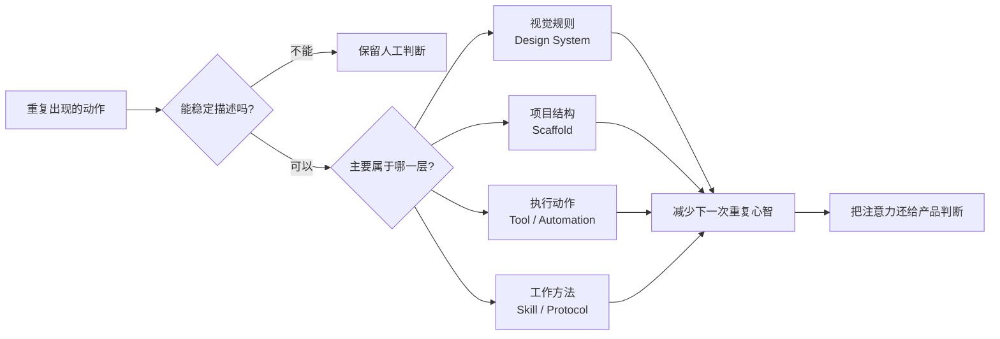

# 把重复操作提炼成产品能力：Com Design Prototype 的第一条原则

Com Design Prototype 目前还是一个非常早期的东西。

它的实现并不复杂：设计系统、项目脚手架、Git、Markdown、任务台账、AI Skills、Review、日报和 CI/CD。很多能力甚至只是把原本散落在人和 AI 对话里的规则，整理成文件和流程。

从技术实现看，它谈不上先进。

甚至可以说，它有非常明显的时代色彩。

几年后，我们今天使用的 Codex、GitHub Actions、Markdown、Skill 这些具体形式，很可能都会变化。但在真实项目里跑起来以后，它已经解决了一批非常迫切的问题。

这也是我们决定继续做它的原因。

> **凡是会重复发生的，就尝试把它提炼出来。**
>
> 不是简单复制，而是把重复行为升级成稳定的产品能力。

## 我们真正想解决的，不是“怎么更快写代码”

一个项目开始时，经常会重复发生这些事情：

- 重新搭项目结构；
- 重新接设计系统；
- 重新决定页面的基础视觉；
- 重新配置工具；
- 重新告诉 AI 项目是什么；
- 重新解释工作分支和权限；
- 重新说明任务卡怎么写；
- 重新约定什么叫完成；
- 重新告诉 AI 怎么 Review；
- 最后再人工整理 commit、任务和日报。

其中任何一个动作都不困难。

问题在于，它们会在每一个项目里重新发生。

而一个小团队最容易被消耗掉的，往往不是那些真正困难的产品问题，而是大量“已经解决过，却还得再做一次”的工作。

<div style="margin:28px 0;padding:20px;border:1px solid var(--hairline);border-radius:16px;background:var(--surface-card)">
  <div style="margin-bottom:14px;font-size:12px;letter-spacing:.09em;color:var(--muted)">COM DESIGN PROTOTYPE · EXTRACTION LAYERS</div>
  <div style="display:grid;grid-template-columns:repeat(auto-fit,minmax(150px,1fr));gap:10px">
    <div style="padding:14px;border:1px solid var(--hairline);border-radius:12px"><b>视觉一致性</b><br><small>Design System / Token / Component</small></div>
    <div style="padding:14px;border:1px solid var(--hairline);border-radius:12px"><b>项目结构</b><br><small>Scaffold / Runtime / CI</small></div>
    <div style="padding:14px;border:1px solid var(--hairline);border-radius:12px"><b>重复执行</b><br><small>Tool / Automation</small></div>
    <div style="padding:14px;border:1px solid var(--hairline);border-radius:12px"><b>工作方法</b><br><small>Skill / Protocol / Evidence</small></div>
  </div>
  <p style="margin:16px 0 0;color:var(--muted)">目标不是把流程做复杂，而是让下一次项目少支付一次相同的心智成本。</p>
</div>

## 第一层：视觉不应该每个项目重新设计

Com Design 最初解决的是设计一致性。

Color、Typography、Spacing、Radius、Icon、组件状态，这些东西第一次需要认真设计。但一旦已经形成设计系统，新项目就不应该再次从零讨论：

按钮多圆？页面边距多少？空状态长什么样？主色应该怎么使用？PC 和 Mobile 应该共享哪些视觉语义？

这些判断应该进入 Design System。

于是新项目面对的不再是一张白纸，而是一套已经有底线的视觉环境。

这不是为了限制设计。恰恰相反，是为了把设计师和产品人员的精力从重复的基础决策里释放出来，用在真正属于这个产品的差异上。

## 第二层：项目结构不应该每次重新搭

视觉之外，很快就遇到了第二类重复问题：工程环境。

一个新的 Prototype 需要 PC、Mobile、Design Tokens、Icons、Prototype Runtime、基础文档、版本控制、CI/CD。

过去这些东西每次都要重新组装。

现在可以逐渐收敛成一个入口：

```text
mira create prototype
```

项目创建以后，不再只是生成几个页面，而是直接得到一个可以工作的产品验证环境。

它已经知道开发与发布的基本边界，已经有 VERSION、Product Brief、任务台账、AI 协作规则，也已经有 Review 和日报的位置。

脚手架在这里不再只是“生成代码”。

它开始承担**初始化项目工作环境**的职责。

## 第三层：AI 的工作方法也应该被提炼

这是 Prototype 最近开始变化最大的地方。

以前每次让一个新的 AI 进入项目，都需要重新告诉它：这个项目是什么、哪些文件不能乱动、工作分支是什么、能不能 commit、什么情况下可以施工、施工完成以后应该进入什么状态、CI 通过算不算完成、什么时候需要人验收。

这些其实也是重复操作。

所以我们开始把它们变成项目协议。

一个 AI 第一次进入 Prototype 项目，应该先读取已经存在的项目事实，再只确认项目里还不知道的部分，例如 GitHub Repository、角色、工具、权限、提交和部署边界。

也就是说，我们开始把“怎么教一个 AI 工作”本身也产品化。



这张图比“多做自动化”更接近 Prototype 的真实目标：**不是消灭人的参与，而是识别哪些地方根本不值得人再参与第二遍。**

## 第四层：项目状态不能继续靠人的记忆维持

任务台账和日报也是同样的问题。

项目只有两三个任务时，人当然可以记住。但任务变多以后，很快就会出现：这张卡到底做完没有？这个 commit 对应哪项需求？AI 说完成了，真的验证了吗？昨天到底改了什么？CI 绿了是不是就可以发布？

于是 Prototype 把任务状态收敛成一条简单的链路：

<div style="margin:26px 0;padding:18px;border:1px solid var(--hairline);border-radius:14px;background:var(--surface-card)">
  <div style="display:flex;flex-wrap:wrap;align-items:center;gap:8px;font-size:14px">
    <span style="padding:9px 13px;border-radius:999px;background:var(--surface-soft)">TODO</span><b>→</b>
    <span style="padding:9px 13px;border-radius:999px;background:var(--surface-soft)">DOING</span><b>→</b>
    <span style="padding:9px 13px;border-radius:999px;background:var(--surface-soft)">REVIEW</span><b>→</b>
    <span style="padding:9px 13px;border-radius:999px;background:var(--surface-soft)">PASS</span>
  </div>
  <p style="margin:14px 0 0;color:var(--muted)"><b>施工完成 ≠ 验收完成。</b> AI 可以把任务做到 REVIEW，但默认不能仅凭自己的声明把它推进到 PASS。</p>
</div>

CI、Build、Test 都只是 Evidence。

它们不能代替产品验收。

日报也不应该只是让 AI 根据聊天内容回忆“今天干了什么”。它应该回到 GitHub commits、任务卡、Work Ledger、PR、CI 与 Review evidence，再生成当天真正发生的变化。

如果有 commit 没有关联任务，标记为未归档；如果任务卡说完成了却没有证据，标记为待核验；如果 contributor 能通过 GitHub 身份确认，就记录真实身份。

我们甚至又补了一层独立的 Daily Report Review：日报自己也需要被回查。

这就是一个典型的“重复动作 → 产品能力”的过程。

## Com Design Prototype 现在是什么

目前更准确的定义是：

> **一个基于 Com Design 的产品验证与 AI 协作运行环境。**

Com Design 提供视觉和设计工程基础。

Prototype 提供项目运行结构。

Mira 目前承担创建和编排入口。

三者并不是同一个东西。

<div style="margin:28px 0;display:grid;grid-template-columns:repeat(auto-fit,minmax(180px,1fr));gap:12px">
  <div style="padding:18px;border:1px solid var(--hairline);border-radius:14px;background:var(--surface-card)"><b>Com Design</b><br><span style="color:var(--muted)">Design System / 产品设计底座</span></div>
  <div style="padding:18px;border:1px solid var(--hairline);border-radius:14px;background:var(--surface-card)"><b>Prototype</b><br><span style="color:var(--muted)">项目工作环境 / 验证运行时</span></div>
  <div style="padding:18px;border:1px solid var(--hairline);border-radius:14px;background:var(--surface-card)"><b>Mira</b><br><span style="color:var(--muted)">创建、理解与编排入口</span></div>
</div>

这个边界很重要。

Com Design 不应该依赖 Mira 才能存在。Prototype 也不应该最终只能服务某一个 AI。Mira 可以使用和编排它们，但不能把它们变成自己的私有能力。

## 现在的手段很初级，但问题并不初级

目前很多协议还是 Markdown，很多状态依然依赖 Git，AI Skill 也是这个阶段非常有时代特征的一种形式，项目创建还是 CLI，GitHub 仍然承担了大量事实源和自动化基础设施。

几年以后，这些具体实现很可能都会变化。

但真正值得保留下来的，并不是 Markdown、GitHub、Codex 或 CLI，而是这些更稳定的问题：

- 项目怎样初始化？
- 视觉一致性怎样继承？
- AI 怎样进入一个陌生项目？
- 权限怎样获得？
- 需求和代码如何建立关系？
- 什么叫施工完成？
- 什么叫验收完成？
- 结果需要什么证据？
- 多个人和多个 AI 怎样共同工作？
- 换一个 AI 后，为什么不需要重新讲一遍项目历史？

工具会变化。

这些问题大概率还在。

所以现阶段，我们不是在制造一个最终工具，而是在逐渐挖出一套可以被反复实现的方法和协议。

## 接下来继续提炼什么

Prototype 后面的演进方向，不应该是为了“完整”继续堆功能。

更有价值的做法，是继续观察真实项目里的重复行为。

只要一个动作开始频繁出现，就问一句：

> **这件事情为什么还需要人每次重新做？**

如果能够稳定描述，就把它变成规则。

如果能够稳定执行，就把它变成工具。

如果能够形成工作方法，就把它变成 Skill。

如果多个项目都需要，就考虑把它提炼进 Seed。

目前已经比较明确的四个方向是：视觉一致性、工具、脚手架、工作方法。

未来还会有更多。

每一个真正进入 Seed 的东西，都应该有一个共同特征：

**它减少了下一次项目启动和运行时需要重复支付的心智成本。**

如果一个所谓的“自动化能力”，反而要求每个项目增加大量配置、学习和维护，那么它可能并没有解决问题，只是把重复劳动换了一种形式。

## 第一条原则

Com Design Prototype 现在当然还谈不上成熟。

但它已经在真实的小团队环境里验证了一件事情：很多非常恼人的协作问题，并不一定首先需要一个庞大的平台。

先把重复发生的东西识别出来。

把视觉变成设计系统。

把环境变成脚手架。

把规则变成协议。

把工作方法变成 Skill。

把状态变成可以验证的事实。

很多问题就已经开始消失。

所以现阶段，我们并不急着给它一个宏大的最终形态。

先继续使用，继续观察，继续提炼。

> **凡是需要重复操作的，全部值得被重新审视。**
>
> **能提炼的，就不要让人下一次再做一遍。**

人应该把时间留下来，去做那些真正需要产品判断、创造力和决策的事情。
